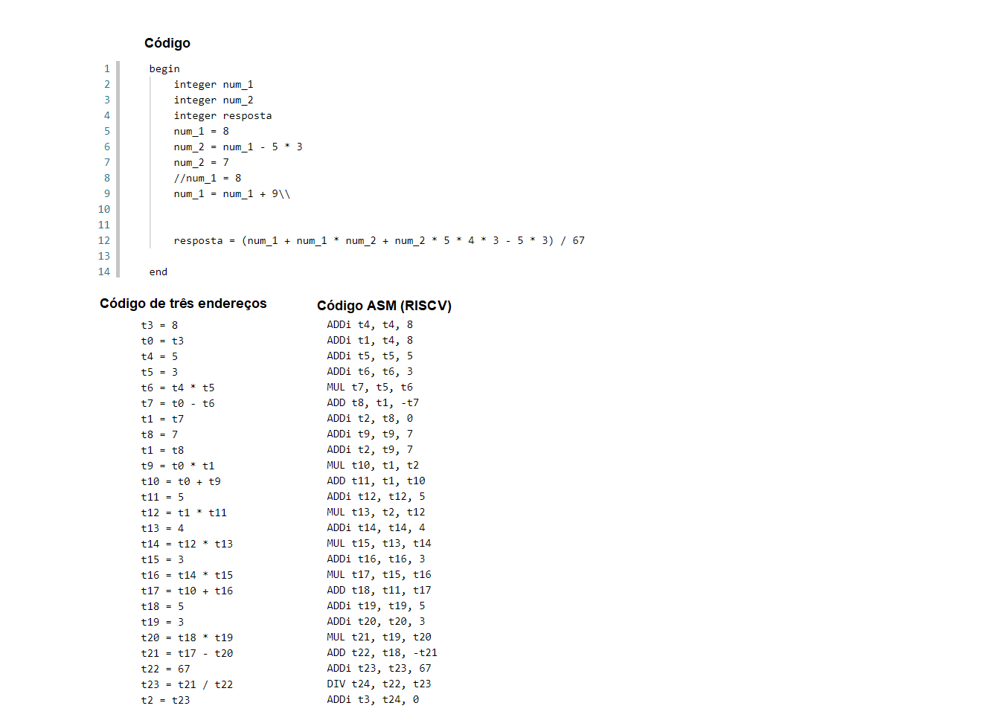
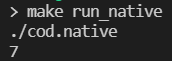

# Chameleon Programming Language

Chameleon is a programming language that is easy and flexible to use. It was developed in 2020 in a college assignment of the subject Compilers. In this project were used C, Flex and YACC/Bison for its development. The description (portuguese only) of this assignment can be found [here](Description-Compilers-2020.pdf). This assignment was divided in three parts:

(1) Programming language definition with your characteristics, features, grammars, keywords, etc. and a standalone version of its Lexical Analyzer;

(2) The Syntax Analyzer and the integration with the Lexical Analyzer;

(3) The Semantic Analyzer, the intermediate code generator and the machine code generator.

Chameleon uses the structured programming paradigm and is inspired by the C, C++ and Python programming languages. A full description (portuguese only) of its characteristics and features can be found in the following documentations:

(1) [Documentation - Part 1 - Programming language definition and a first version of the Lexical Analyzer](doc_1_daniel_joao_maria_naiara.pdf)

(2) [Documentation - Part 2 - Syntax Analyzer and the integration with the Lexical Analyzer](doc_2_daniel_joao_maria_naiara.pdf)

(3) [Documentation - Part 3 - Semantic Analyzer, intermediate code generator and the machine code generator](doc_3_daniel_joao_maria_naiara.pdf)

**Using Docker**

If you have [Docker](https://docs.docker.com/get-docker/), there is no need to install the dependencies below. You can use `make run_docker` to build the image and run a docker container, and use `make enter_docker_container` to enter the Linux shell and follow the instructions in [Executing](#executing) session.

Related files: [Dockerfile](Dockerfile) and [Makefile](Makefile).

**Requirements (no need to install them if you have Docker):**
- Flex - Fast Lexical Analyzer Generator (tested / recommended version: 2.6.4)
    - sudo apt-get install flex
- YACC - Yet Another Compiler-Compiler (tested / recommended versions: 3.5.1 (bison), 1.9 20140715 (byacc))
    - sudo apt install bison
    - sudo apt install byacc
- (To execute on machine) Clang and LLVM (tested / recommended versions: 10.0.0-4ubuntu1 (clang), 10.0.0 (llvm))
    - sudo apt install clang
    - sudo apt install llvm

**Limitations:**
- For the current version, the machine code generation is limited to codes written in Chameleon that performs only mathematic operations. However, this limitation can be removed in future versions, since the compiler generates intermediate code for most of the features that it provides.
- Chameleon offers a preprocessor that works similar to using MACROS in C. You can customize keywords and "create" your own language. However, you can't create custom commands with the current feature like we can do in C. Its use is optional.

# Executing

Refering to the [Makefile](Makefile), you can execute the following commands:
- **To generate the compiler:** make 
- **To execute the compiler for a Chameleon code:** make run < here_is_an_input_file_path
- **To execute LLVM and generate machine code:** make llvm
- **To execute machine code:** make run_native
    - **ps:** only mathematic calculations works in this version and the last result is printed.

Figure below shows a Chameleon code that performs a mathematic calculation. Also, it shows its three-code address and an ASM (RISC-V) representation. This code can be found [here](input/08_calculo) and can be executed in the machine generating a LLVM representation.

Executing **make run_native**:

Copyright © 2021 Daniel Freitas Martins (dnlfm), Maria Dalila Vieira (dalilavieira), Naira Cristiane dos Reis Diniz (NaiaraDiniz) and João Arthur Gonçalves do Vale (joaoarthurv)